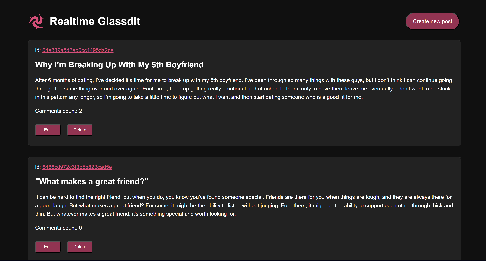
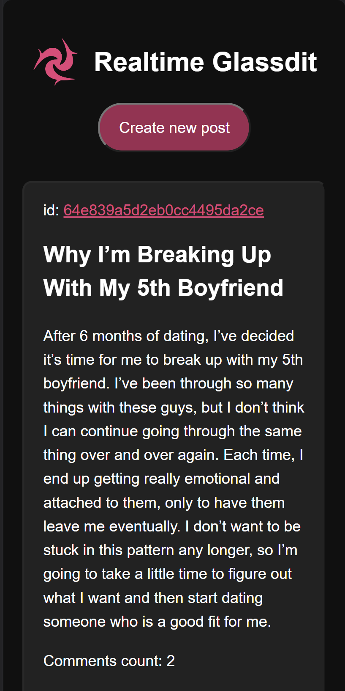

# Glassdit - a Real-Time Message Board

## Table of contents

- [Overview](#overview)
  - [The challenge](#the-challenge)
  - [Screenshot](#screenshot)
  - [Links](#links)
  - [Built with](#built-with)
- [Author](#author)

## Overview

### The challenge

Set goals for the application:

- Create a complete interactable message board
- Upload | Edit | Read posts, Post comments
- Updated in real-time
- Changes on other platforms using same API will reflect as well

### Screenshot
Desktop UI

Mobile UI

### Links

- Live Site URL: [Vercel](https://glassdit.vercel.app)

### Built with

- React
- CSS

## Author

- Website - [miraskab](https://github.com/mkab2000)